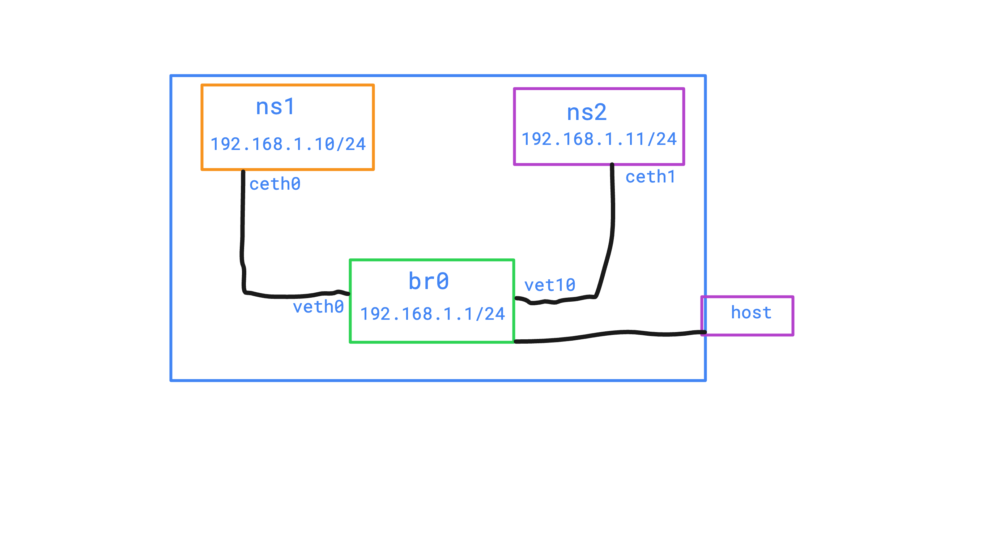
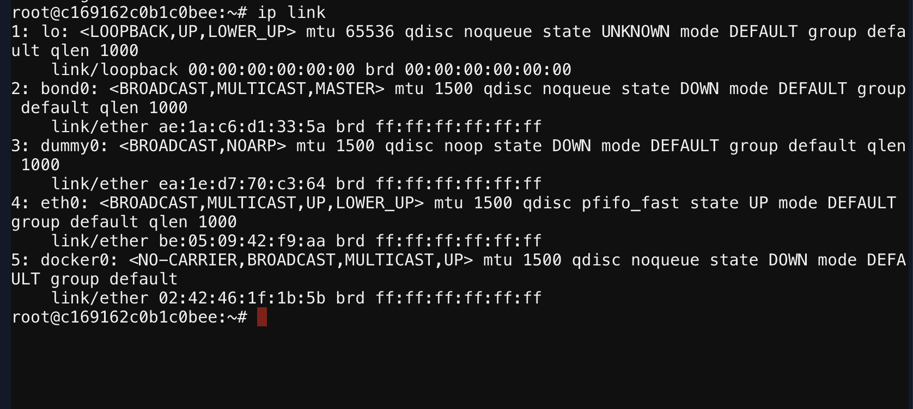
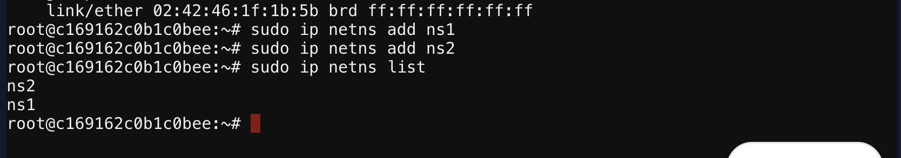
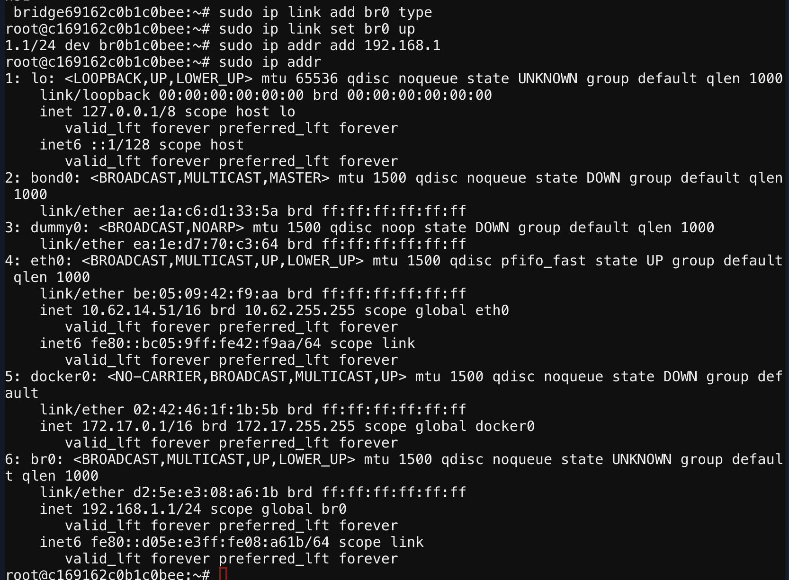
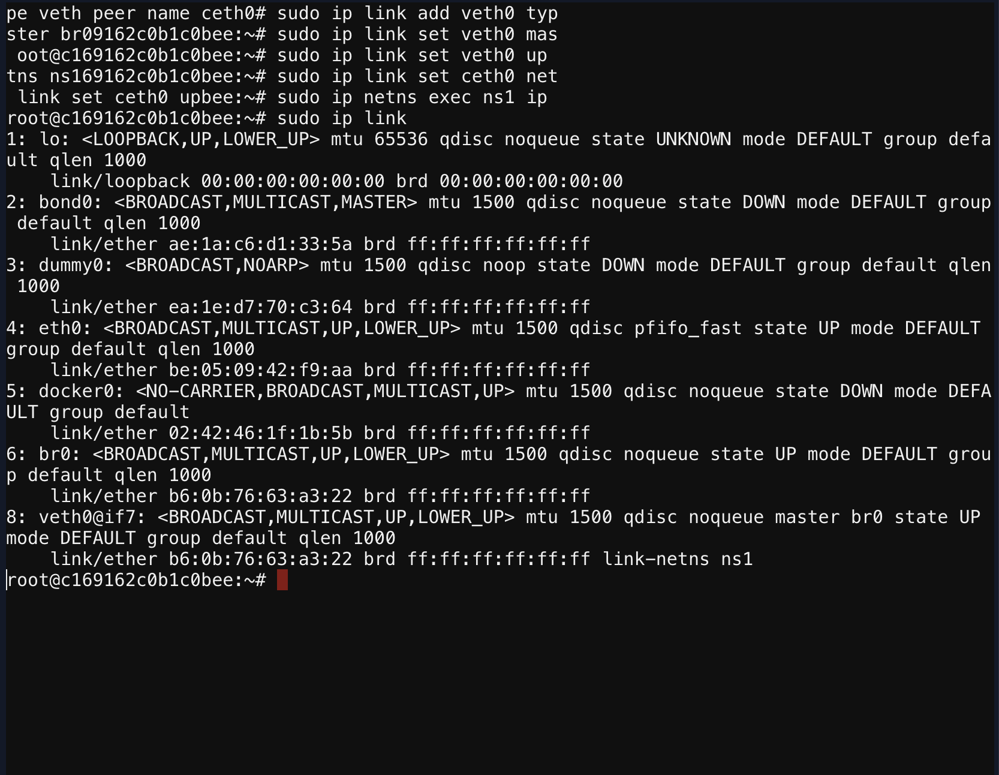
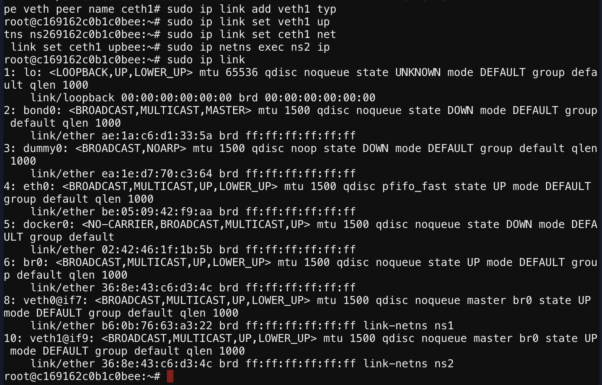
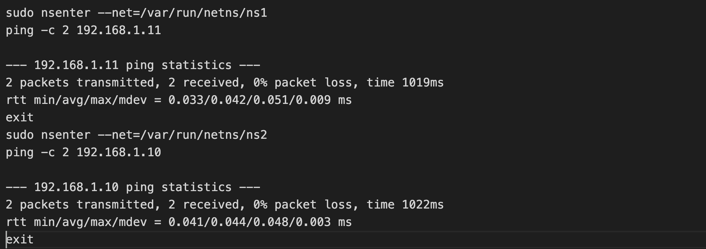

## A network namespace in Linux is a feature that allows you to create isolated network environments within a single operating system. Each network namespace has its own interfaces, routing tables, forwarding rules, etc. A physical network device can live in exactly one network namespace. In this project I'll communicate between two isolate network namespace using bridge.





###  Check basic network status on host machine/root namespace. 
``` bash
sudo ip link
```



### Create two network namespace
``` bash
sudo ip netns add ns1
sudo ip netns add ns2
```



### Create a bridge network on the host
``` bash
sudo ip link add br0 type bridge
```


### Configure IP to the bridge network
```bash
sudo ip addr add 192.168.1.1/24 dev br0
```



### Configure IP to the bridge network
``` bash
sudo ip link set br0 up
```


### Create two virtual ethernet cable for two network netns, then attach to the bridge and netns
#### For ns1
``` bash
# creating a veth pair which have two ends identical veth0 and ceth0
sudo ip link add veth0 type veth peer name ceth0
# connect veth0 end to the bridge br0
sudo ip link set veth0 master br0
# up the veth0 
sudo ip link set veth0 up 
# connect ceth0 end to the netns ns1
sudo ip link set ceth0 netns ns1
# up the ceth0 using 'exec' to run command inside netns
sudo ip netns exec ns1 ip link set ceth0 up
# check the link status 
sudo ip link
```



#### For ns2 do the same as ns1
``` bash
sudo ip link add veth1 type veth peer name ceth1
sudo ip link set veth1 master br0
sudo ip link set veth1 up
sudo ip link set ceth1 netns ns2
sudo ip netns exec ns2 ip link set ceth1 up

sudo ip link 
```



### Add IP address for ns1
```bash
sudo ip netns exec ns1 ip addr add 192.168.1.10/24 dev ceth0
```


### Add IP address for ns2
```bash
sudo ip netns exec ns2 ip addr add 192.168.1.11/24 dev ceth1
```

### Verify connectivity between two namespace
#### For ns1
```bash
sudo nsenter --net=/var/run/netns/ns1
ping -c 2 192.168.1.11
exit
```


#### For ns2
```bash
sudo nsenter --net=/var/run/netns/ns2
ping -c 2 192.168.1.10
exit
```



### Connectivity between two network namespaces via bridge is completed.
